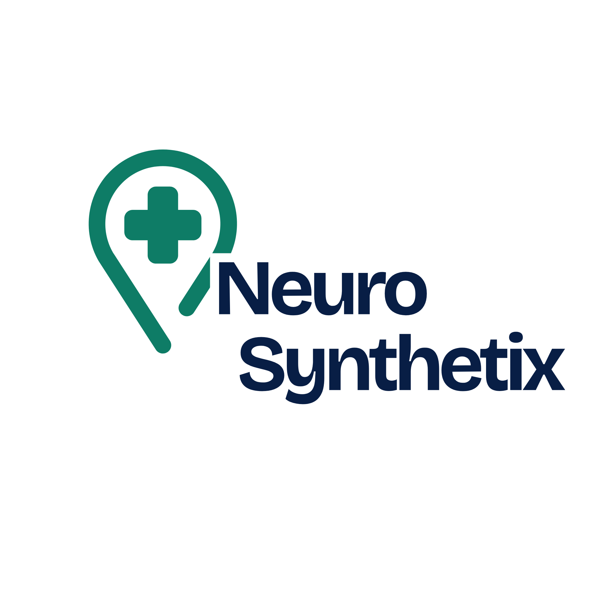

<p align="center"></p>

# Neuro-Synthetix

**A voice bridge between patients and the clinical trials that could help them.**

Neuro-Synthetix lets anyone describe how they feel, by voice or text, in their own
language, and finds real clinical trials that are recruiting, near them. It does not
diagnose. It orients toward trials, always reminding the patient to confirm with a doctor.

Built for **HackHazards '26** — theme HealthTech & Bio Platforms.
Live: https://neuro.shadrakbessanh.me

## 📱 Mobile app (Expo)

The same assistant runs as a native app. Install **Expo Go** on your phone, then
scan the QR code below (or open the link inside Expo Go):


```
exp://ncarnci-bsh54-8081.exp.direct
```

The app hosts the same backend, so voice, AI search and real trials work out of the box.
Source: [`mobile/`](mobile/) · built with Expo / React Native.

---

## What it does

1. **Country first.** The assistant always asks the patient's country of residence before
   anything else, and explains why: trials recruit at physical hospital sites, so we first
   look for trials in the country where the person can actually take part. It is the single
   strongest, most honest filter.
2. **Conversational AI (DeepSeek, tool calling)** leads a short, clinician-like conversation:
   it understands any wording (slang, a drug name, a body part, a clue, another language, a
   misspelling), asks a couple of focused questions only when needed, and searches early.
3. **Retrieval + AI re-ranking (RAG):** a fast retrieval pulls ~25 real candidate trials from
   a base of ~5000 unified from public registries; DeepSeek then re-ranks them, keeping only
   the genuinely relevant ones and explaining, in one sentence, why each fits. It can only
   choose from real candidates, so it never invents a trial.
4. **Criterion-level eligibility + confidence:** a focused second pass reads each chosen
   trial's real inclusion/exclusion text and shows, criterion by criterion, whether the
   patient looks eligible (met / not met / unknown), with an overall confidence score.
5. **Next steps + referral:** every trial shows a clear "how to proceed" path (reference,
   see your doctor, contact the site, participation is free), the official link, and a
   one-tap **Refer / Share (WhatsApp)** button to pass the trial to a patient or doctor.
6. **Multilingual, voice-first:** everything runs on an English internal pipeline for
   reliability, then is translated back to the patient's language (Hindi, French, English).
   Speech-to-text and text-to-speech run through Sarvam AI. Audio only plays in voice mode,
   never while typing.
7. **Health-worker (ASHA) mode:** a toggle turns the tool into a per-patient workflow so a
   community health worker can look up trials for several villagers and refer them.
8. A **graph** (Neo4j) visualizes the care pathway of the chosen results.

## Data sources (unified)

- ClinicalTrials.gov (global + a dedicated India pull)
- CTIS — EU Clinical Trials Information System (public API)
- ISRCTN (UK / international)

Refreshed automatically every 12 hours. Every trial keeps its official reference
(NCT / CTIS / ISRCTN) so it can be verified at the source.

## How the AI search works (funnel, never the whole database)

We never send 5000 trials to the model — that would be impossible on tokens and would drown
it in noise. Instead the search is a funnel of successive filters:

```
~5000 trials
  │  Filter 1 — retrieval (code, 0 tokens): country + condition + keyword scoring
  ▼
 ~25 candidates          (only these ever reach the model)
  │  Filter 2 — AI re-rank: keep the genuinely relevant ones + one-sentence reason
  ▼
 ~5 trials
  │  Filter 3 — AI eligibility: per-criterion check + confidence, on the real criteria text
  ▼
 final results (grounded, explained, with confidence)
```

Everything the model reasons about is in **English internally** (patient input is translated
in, results translated back out), which makes it robust for **any** condition and any input
language, with no disease-specific hardcoding.

## Responsible AI (aligned with ICMR 2023 ethical AI guidelines)

- **Human oversight:** it orients, never diagnoses; every result reminds the patient to
  confirm with their own doctor.
- **Verifiable sources:** every trial keeps its official reference; nothing is invented.
- **Transparency:** we show why each trial fits and check eligibility criteria one by one.
- **Data privacy:** no account, no medical record stored; the conversation stays on device.

## Stack

- **Backend:** FastAPI (Python), Docker, deployed behind a Cloudflare tunnel
- **Graph:** Neo4j (symptom → condition → trial → hospital)
- **AI:** DeepSeek (conversation, tool calling, RAG re-rank, eligibility), Sarvam AI
  (STT / TTS), OpenAI-compatible translation API (input + output for Hindi and French)
- **Frontend:** static HTML/CSS/JS (chat, voice mode, map, proof page) + Expo / React Native app
- **Data:** unified clinical-trial knowledge base (built by `app/kb_builder.py`)

## Project layout

```
backend/
  app/
    main.py            FastAPI app and routes
    deepseek.py        conversation + tool calling + RAG re-rank + eligibility
    retrieval.py       candidate retrieval + ranking (RAG step 1)
    kb_search.py       keyword search helper
    kb_builder.py      builds the unified knowledge base from the registries
    sarvam.py          Sarvam STT / TTS
    translate.py       translation (English internal pipeline: Hindi + French)
    graph.py           Neo4j queries + graph payload
    extract.py         multilingual symptom lexicon
    stats.py           metrics + map locations for the proof page
    conditions.py      condition / symptom data backbone
    static/            landing.html, index.html (chat), proof.html
  requirements.txt
  Dockerfile
deploy/                deployment helpers (SSH via paramiko)
docs/                  PLAN.md, AI_SEARCH_DESIGN.md, SCENARIO_TEST.txt
```

## Run locally

```bash
cd backend
python -m venv .venv && source .venv/Scripts/activate   # Windows Git Bash
pip install -r requirements.txt
cp .env.example .env      # fill in Neo4j, Sarvam, translation and DeepSeek keys
python -m app.kb_builder  # build the knowledge base (~5000 real trials)
uvicorn app.main:app --reload
```

Then open http://localhost:8000

### Environment variables (`.env`)

```
NEO4J_URI, NEO4J_USER, NEO4J_PASSWORD
SARVAM_API_KEY
TRANSLATE_API_URL, TRANSLATE_API_KEY
DEEPSEEK_API_KEY
```

No secret is committed. `.env` and any key files are git-ignored.

## Endpoints

- `GET  /`            landing page
- `GET  /app`         the assistant (chat + voice)
- `GET  /proof`       data metrics + world map of research sites
- `POST /chat`        conversational search (AI + RAG)
- `POST /tts` `/stt`  Sarvam voice
- `GET  /stats` `/locations` `/site`  data for the proof page and map

## Disclaimer

Neuro-Synthetix is an orientation tool. It does not provide a medical diagnosis and does
not replace a doctor's advice.
